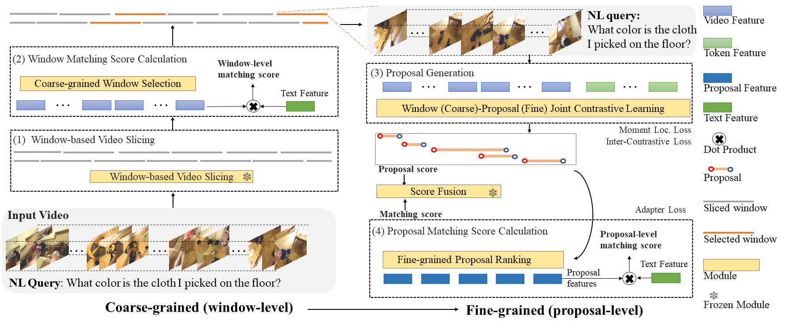

# CONE: An Efficient COarse-to-fiNE Alignment Framework for Long Video Temporal Grounding

[ArXiv Preprint](https://arxiv.org/abs/2107.09609)


> **TL;DR:**  CONE (see overview below) deals with an emerging and challenging problem of
video temporal grounding (VTG) in the long-form video.
It is a plug-and-play framework on top  of existing VTG models to handle long videos
through a sliding window mechanism. 
It is also a coarse-to-fine alignment framework that utilizes a pipeline of {window
slicing and selection, proposal generation and ranking}.



This repo supports data pre-processing, training and evaluation of both Ego4D-NLQ and MAD benchmarks. 


## 📢 News
- [2023.5.30] We release the CONE codebase.
- [2022.10.24] CONE model won [**3rd place** in NLQ](https://eval.ai/web/challenges/challenge-page/1629/overview)@ [Ego4D Challenge 2022](https://ego4d-data.org/workshops/eccv22/), hosted by ECCV 2022. Please refer to [Ego4D-NLQ_ECCV_2022_workshop](./ECCV_2022_workshop/README.md) for detailed information.
<!--- (- [2022.9.22] We release the [arXiv preprint](https://arxiv.org/abs/2107.09609) paper.) --->


## 🗄 Table of Contents

* [Preparation](#Preparation)
    * [Install dependencies](#Install-dependencies)
    * [Prepare offline data (e.g., features and files)](Prepare-offline-data)
* [Experiments](#Experiments)
    * [Ego4D-NLQ benchmark](#Ego4D)
      * [Train](#Ego4D-NLQ-training)
      * [Inference](#Ego4D-NLQ-inference)
    * [MAD benchmark](#MAD)
      * [Train](#MAD-training)
      * [Inference](#MAD-inference)
*  [Demo: Run predictions on your own videos and queries](#run-predictions-on-your-own-videos-and-queries)   

* [Contact](#Contact)  
* [Acknowledgement](#acknowledgement)


## 📝 Preparation

### Install-dependencies 
* Follow [INSTALL.md](./INSTALL.md) for installing necessary dependencies and compiling the code.


### Prepare-offline-data

### 
- Download full Ego4D-NLQ data [Ego4D-NLQ](https://drive.google.com/file/d/1QsG7Jp8tYjisvZkMZiB5r1stAsVo86EY/view?usp=sharing) (8.29GB).
- Download partial MAD data [MAD](https://drive.google.com/file/d/1DYX_rXn0mjiAx36sdsF3W14D--3XnMQB/view?usp=sharing) (6.5GB). We CAN NOT share the MAD visual features at this moment, please request access to the MAD dataset from official resource [MAD github](https://github.com/Soldelli/MAD).
- We provide the feature extraction and file pre-processing procedures for both benchmarks in detail, please refer to [Feature_Extraction_MD](./feature_extraction/README.md).

* If you unzip the Ego4D-NLQ data, the extracted folder structure should look like
```
This folder
└───offline_extracted_features/
│    └───egovlp_video_feature_1.875fps.tar.gz    
│    └───egovlp_text_cls_feature.tar.gz
│    └───egovlp_text_token_feature.tar.gz
│    └───...
└───offline_lmdb/
│    └───egovlp_video_feature_1.875fps/
│    └───egovlp_egovlp_text_features/
│    └───...
└───data/
│    └───ego4d_ori_data/
│    │	 └───nlq_train.json
│    │	 └───...
│    └───ego4d_data/
│    │	 └───train.jsonl
│    │	 └───...
└───one_training_sample/
│    └───tensorboard_log/    
│    └───inference_ego4d_val_top20_nms_0.5_preds.txt
│    └───inference_ego4d_val_top20_nms_0.5_preds.json
│    └───...
```

## 🔧 Experiments

Note that our default base model is [Moment-DETR](https://github.com/jayleicn/moment_detr). 
Additionally, we also release the code with [2D-TAN](https://github.com/microsoft/VideoX/tree/master/2D-TAN) as the base model. Please refer to [2D-TAN README](cone_2dtan/README_2D-TAN.md).

### Ego4D-NLQ
Please refer to [Ego4d-NLQ_ECCV_2022_workshop](./ECCV_2022_workshop/README.md) for detailed information about our submission for Ego4D ECCV 2022 Challenge.


#### Ego4D-NLQ-training
Training can be launched by running the following command:
```
bash cone/scripts/train_ego4d.sh CUDA_DEVICE_ID NUM_QUERIES WINDOW_LENGTH ADAPTER 
```
`CUDA_DEVICE_ID` is cuda device id.
`NUM_QUERIES` is moment queries number, default as 5.
`WINDOW_LENGTH` is visual feature number inside one video window.
`ADAPTER` is model type string for visual adapter module, can be one of `linear` and `none`. 

The checkpoints and other experiment log files will be written into `cone_results`. For training under different settings, you can append additional command line flags to the command above. 
For more configurable options, please check our config file [cone/config.py](cone/config.py).

The actual command used in the experiments is
```
bash cone/scripts/train_ego4d.sh 0 5 90 linear 
```

In additional, we find that the performance empirically increases when the textual token feature extractor is replaced by
CLIP or RoBERTa, thus, we recommend you to use CLIP or RoBERTa token feature via the following commands,
```
bash cone/scripts/train_ego4d_clip.sh 0 5 90 linear 
bash cone/scripts/train_ego4d_roberta.sh 0 5 90 linear 
```

#### Ego4D-NLQ-inference
Once the model is trained, you can use the following commands for inference:
```
bash cone/scripts/inference_ego4d.sh CUDA_DEVICE_ID CHECKPOINT_PATH EVAL_ID  --nms_thd 0.5  --topk_window 20
bash cone/scripts/inference_ego4d_test.sh CUDA_DEVICE_ID CHECKPOINT_PATH EVAL_ID --nms_thd 0.5  --topk_window 20
```
where `CUDA_DEVICE_ID` is cuda device id, `CHECKPOINT_PATH` is the path to the saved checkpoint, `EVAL_ID` is a name string for evaluation id.
We adopt Non-Maximum Suppression (NMS) with a threshold of 0.5 and set pre-filtering window number as 20.

* The results (Recall@K at IoU = 0.3 or 0.5) on the val. set should be similar to the performance of the below table reported in the main paper.

| Metric \  Method        | R@1 IoU=0.3 | R@5 IoU=0.3 | R@1 IoU=0.5 | R@5 IoU=0.5   |
|------------------|-------------|-------------|-------------|---------------|
| CONE             | 14.15       | 30.33       | 8.18        | 18.02         | 

In additional, we provide our experiment log files [Ego4D-NLQ-Training-Sample](https://drive.google.com/file/d/1HSF7ZWIP4ay0IU4jC8prulbZ1RGvz-TS/view?usp=sharing)(24MB).

Note that we inference on 3874 queries in validation split, but [NaQ](https://github.com/srama2512/NaQ) removes zero-duration ground-truth queries and inferences on 3529 queries in validation split .
The performance of CONE will be higher (i.e., multiplied by 3874/3529=1.098) if we use the same validation split of NaQ.

### MAD
#### MAD-training
Training can be launched by running the following command:
```
bash cone/scripts/train_mad.sh CUDA_DEVICE_ID NUM_QUERIES WINDOW_LENGTH ADAPTER  
```
`CUDA_DEVICE_ID` is cuda device id.
`NUM_QUERIES` is moment queries number, default as 5.
`WINDOW_LENGTH` is visual feature number inside one video window.
`ADAPTER` is model type string for visual adapter module, can be one of `linear` and `none`.

The actual command used in the experiments is
```
bash cone/scripts/train_mad.sh 0 5 125 linear 
bash cone/scripts/train_mad.sh 0 5 125 none --no_adapter_loss 
```


#### MAD-inference
Once the model is trained, you can use the following commands for inference:
```
bash cone/scripts/inference_mad.sh CUDA_DEVICE_ID CHECKPOINT_PATH EVAL_ID  --nms_thd 0.5  --topk_window 30
bash cone/scripts/inference_mad_test.sh CUDA_DEVICE_ID CHECKPOINT_PATH EVAL_ID  --nms_thd 0.5  --topk_window 30
``` 
where `CUDA_DEVICE_ID` is cuda device id, `CHECKPOINT_PATH` is the path to the saved checkpoint, `EVAL_ID` is a name string for evaluation id.

We adopt Non-Maximum Suppression (NMS) with a threshold of 0.5 and set pre-filtering window number as 30.


* The results (Recall@K at IoU = 0.3) should be similar to the performance of the below table reported in the main paper.

| Method \ R@K | 1    | 5     | 10    | 50    |
|--------------|------|-------|-------|-------|
| CONE (val)   | 6.73 | 15.20 | 20.07 | 32.09 |
| CONE (test)  | 6.87 | 16.11 | 21.53 | 34.73 |

In additional, we provide the experiment log files [MAD-Training-Sample](https://drive.google.com/file/d/1nqCezvO7owIgF2CFCy0TlJe7rV2lpFYB/view?usp=sharing)(370MB).


## 🏋️‍️ Run predictions on your own videos and queries
You may also want to run CONE model on your own videos and queries. 
Currently, it supports moment retrieval on first-person videos with EgoVLP video feature extractor. For third-person videos, the video/text feature extractors should be replaced with CLIP for better performance.

### Preliminaries
Mkdir the ckpt folder and place two weight files [Egovlp.pth](https://drive.google.com/file/d/1-cP3Gcg0NGDcMZalgJ_615BQdbFIbcj7/view)
and [model_best.ckpt](https://drive.google.com/file/d/19phCRf8TPe-bR634ipdgXQ2fnS0Kzxak/view?usp=sharing)
into the ckpt folder

Mkdir the example folder and place one [Ego4D video](https://drive.google.com/file/d/1noXH-aStiVB0V_COjhluagq6CuEsa2q6/view?usp=sharing) example with the uid "94cdabf3-c078-4ad4-a3a1-c42c8fc3f4ad" into the example folder

Install some additional dependencies 
```
pip install transformers easydict decord
pip install einops timm
pip install pytorchvideo
```

### Run
Run the example provided in this repo:
```bash
python run_on_video/run.py
```
The output will look like the following:
```
Build models...
Loading feature extractors...
Loading EgoVLP models
Some weights of the model checkpoint at distilbert-base-uncased were not used when initializing DistilBertModel: ['vocab_layer_norm.weight', 'vocab_layer_norm.bias', 'vocab_transform.bias', 'vocab_projector.weight', 'vocab_projector.bias', 'vocab_transform.weight']
- This IS expected if you are initializing DistilBertModel from the checkpoint of a model trained on another task or with another architecture (e.g. initializing a BertForSequenceClassification model from a BertForPreTraining model).
- This IS NOT expected if you are initializing DistilBertModel from the checkpoint of a model that you expect to be exactly identical (initializing a BertForSequenceClassification model from a BertForSequenceClassification model).
Loading trained Moment-DETR model...
Loading CONE models
Run prediction...
video_name:  94cdabf3-c078-4ad4-a3a1-c42c8fc3f4ad
text_query:  Did I wash the green pepper?
-----------------------------prediction------------------------------------
Rank 1, moment boundary in seconds: 87.461 103.1118, score: 1.9370151082074316
Rank 2, moment boundary in seconds: 350.099 360.7614, score: 1.9304019422713785
Rank 3, moment boundary in seconds: 95.9942 101.9733, score: 1.9060271403367295
Rank 4, moment boundary in seconds: 275.3885 286.7189, score: 1.8871944230965596
Rank 5, moment boundary in seconds: 384.3145 393.3277, score: 1.701088363940821  
```

## ✉️ Contact

This repo is maintained by Zhijian Hou. Questions and discussions are welcome via zjhou3-c@my.cityu.edu.hk.


## 🙏 Acknowledgements
This code is based on [Moment-DETR](https://github.com/jayleicn/moment_detr). 
We use some resources from  [CLIP](https://github.com/openai/CLIP), [EgoVLP](https://github.com/showlab/EgoVLP) to extract the features. 
We thank the authors for their awesome open-source contributions. 
